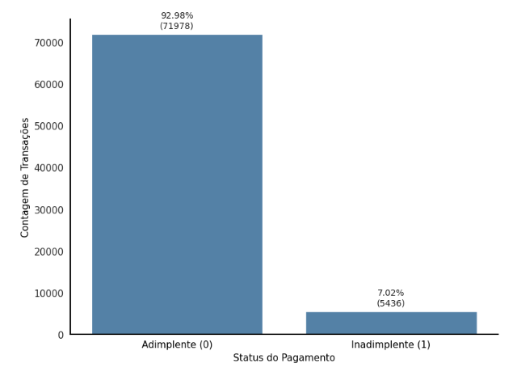
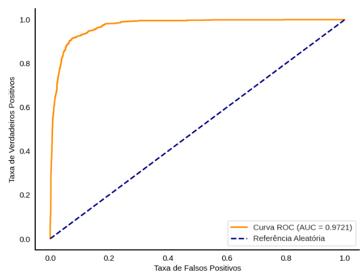
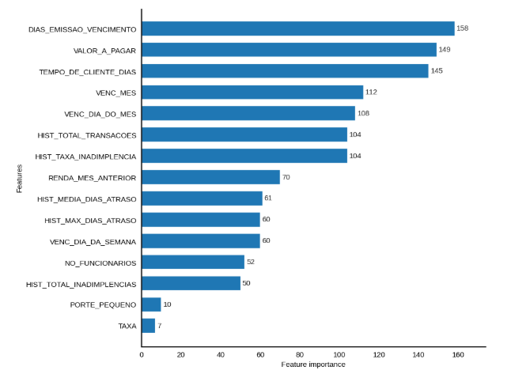
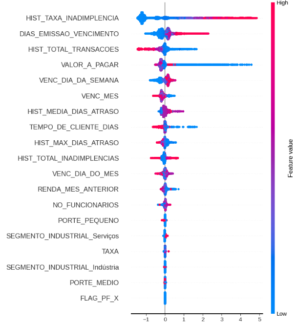

# Aplicação de Machine Learning na Predição de Inadimplência e Apoio à Decisão de Crédito

<p align="center">
  
  
  
  
</p>

## 📌 1. Visão Geral do Projeto
Este projeto foi desenvolvido como **Trabalho de Conclusão de Curso (TCC)** para o **MBA em Data Science & Analytics da USP/Esalq (2026)**. O objetivo principal consiste em estruturar um modelo preditivo robusto e interpretável para estimar a probabilidade de inadimplência de transações de crédito, mitigando a assimetria de informação e apoiando a tomada de decisão automatizada em instituições financeiras.

### A Regra de Negócio (Target)
A inadimplência foi definida sob a regra de negócio rigorosa de **atraso igual ou superior a 5 dias** em relação à data de vencimento original do título.

---

## 🛠️ 2. Arquitetura de Dados e Pipeline Modular (CRISP-DM)
O desenvolvimento seguiu o framework metodológico **CRISP-DM**, integrando de forma modular quatro fontes de dados distintas de natureza firmográfica, socioeconômica e comportamental/transacional de pagamentos:

1.  **Base Cadastral** (`base_cadastral.csv`): Perfil estático do cliente (PF vs. PJ, segmento industrial, porte).
2.  **Base de Informações Mensais** (`base_info.csv`): Dados voláteis (renda do mês anterior, número de funcionários).
3.  **Base de Pagamentos - Desenvolvimento** (`base_pagamentos_desenvolvimento.csv`): Histórico transacional completo de pagamentos e datas de liquidação real.
4.  **Base de Pagamentos - Teste** (`base_pagamentos_teste.csv`): Base de validação cega para simulação em ambiente produtivo.

### Pré-processamento Modular
Para preservar a integridade estatística, adotou-se uma estratégia de limpeza e tratamento individualizada em cada base antes da junção (*merge*) via chave primária `ID_CLIENTE` e referência temporal `SAFRA_REF`. Esse procedimento evitou que a duplicação de registros distorcesse as medidas de tendência central.
*   **Imputação por Mediana:** Utilizada para preencher dados ausentes em variáveis numéricas assimétricas (como renda e funcionários), neutralizando o viés gerado por *outliers*.
*   **Tratamento Categórico:** Variáveis categóricas foram tratadas via preenchimento pela moda e codificadas por meio de variáveis *dummy*.

---

## 🛡️ 3. Engenharia de Atributos e Prevenção de Data Leakage
A etapa de *Feature Engineering* concentrou-se na criação de atributos comportamentais históricos altamente preditivos baseados nas datas de emissão, vencimento e liquidação:
*   `TEMPO_DE_CLIENTE_DIAS`: Tempo total de relacionamento em dias.
*   `HIST_MEDIA_DIAS_ATRASO`: Média de dias de atraso histórico do tomador.
*   `HIST_TAXA_INADIMPLENCIA`: Taxa histórica de transações inadimplidas.

### Proteção Contra Vazamento de Dados (*Data Leakage*)
Para garantir que o modelo não utilizasse informações futuras para prever o passado, a geração dos atributos históricos foi estritamente protegida através das funções:
*   **`expanding()`**: Para capturar a janela acumulativa de histórico crescente de cada cliente.
*   **`shift(1)`**: Para deslocar a informação temporal no tempo, assegurando que apenas dados consolidados no passado fossem utilizados na predição do evento futuro.

---

## 📈 4. Estratégia de Validação e Benchmark de Modelos

### Validação Temporal (*Out-of-Time split*)
Abandonei a divisão aleatória convencional (*K-Fold* ou *Random Split*), que falha em simular o comportamento de modelos no tempo em cenários de crédito. Reservei os **2 meses mais recentes da safra** para validação cega, simulando fielmente a performance do algoritmo em ambiente real de produção.

### Mitigação do Desbalanceamento de Classes
A análise exploratória (EDA) diagnosticou um desbalanceamento severo: apenas **7,02% das transações eram inadimplentes**. Em vez de aplicar reamostragens artificiais (como SMOTE), configurei o ajuste nativo no LightGBM através do parâmetro:

$$\text{scale\textunderscore pos\textunderscore weight} = \frac{\text{Contagem de Registros Negativos (Adimplentes)}}{\text{Contagem de Registros Positivos (Inadimplentes)}}$$

<p align="center">
  
</p>

### Tabela de Benchmark de Performance (Métrica AUC-ROC)
<p align="center">
  
</p>

| Modelo Preditivo | AUC-ROC na Validação | Características Técnicas de Treinamento |
| :--- | :---: | :--- |
| **LightGBM** | **0,9721** | **Modelo Vencedor. Treinado com Early Stopping convergindo em 42 iterações e scale_pos_weight nativo para controle de viés.** |
| Random Forest | 0,9715 | Alta performance de separabilidade, mas com elevado custo computacional e menor eficiência de escala. |
| Regressão Logística | 0,9386 | Baseline linear. Falhou em capturar interações não-lineares complexas de múltiplos atributos. |

---

## 🧩 5. Explicabilidade Global e Local (XAI via SHAP)
Para mitigar o comportamento de "caixa-preta" (*black box*) do algoritmo LightGBM e atender a critérios rígidos de governança e transparência de crédito, apliquei o método **SHAP (SHapley Additive exPlanations)**, fundamentado na Teoria dos Jogos Cooperativos.
<p align="center">
  
  
</p>


### Principais Determinantes de Risco Decifrados:
1.  **`HIST_TAXA_INADIMPLENCIA`**: Valores históricos de atraso elevados exercem o maior impacto marginal positivo, empurrando a probabilidade de score de risco para cima.
2.  **`TEMPO_DE_CLIENTE_DIAS`**: O tempo prolongado de relacionamento atua como o principal fator de proteção e mitigação do risco de inadimplência.

---

## 🚀 6. Como Executar o Projeto

1. **Clonar o Repositório**:
   ```bash
   git clone https://github.com/xjonathansilva/datarisk-credit-default-prediction.git
   cd datarisk-credit-default-prediction
Instalar Dependências: Instale o ambiente virtual reproduzível listado no requirements.txt:
pip install -r requirements.txt
Executar o Notebook: Abra o Jupyter Notebook para visualizar o pipeline de ponta a ponta:
jupyter notebook notebooks/model_development.ipynb

📄 Licença
Este projeto está sob a licença MIT - consulte o arquivo LICENSE para detalhes.

**Autor:** Jonathan Gabriel Silva
**Orientadora:** Ricardo Limongi França Coelho
**MBA em Data Science & Analytics — USP/Esalq 2026**
